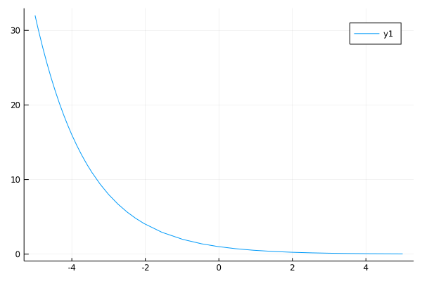
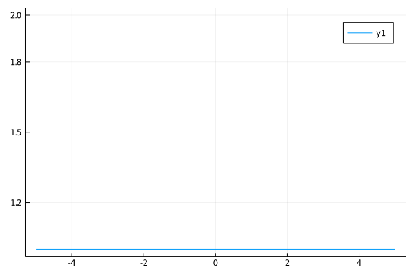
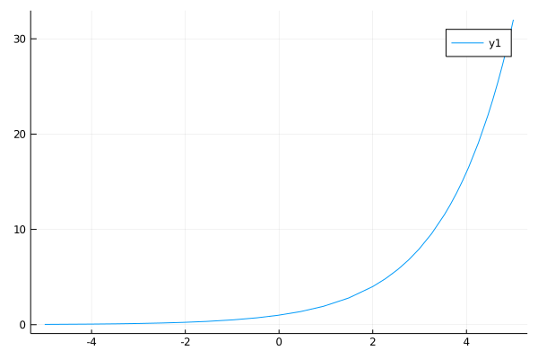

### Exponential functions in Julia 

Welcome to my self-tutorial on exponential functions in Julia.

For those new to the Julia here are some resources:
1. [Julia language](https:julialang.org)
2. [Installing Julia](https://julialang.org/downloads/)
3. [Julia's package manager](https://docs.julialang.org/en/v1/stdlib/Pkg/)
4. [Calculus with Julia](https://docs.juliahub.com/CalculusWithJulia/AZHbv/0.0.16/)

This article was written using [jupyter](https://jupyter.org/).


```julia
using CalculusWithJulia, Plots
```

### What is a function?

A function is a defined relationship between and some input and some output.<br>
In math a functions input is called it's domain, and output is called range.<br>

$$ \text{domain goes in}~\to~\text{function}~\to~\text{range comes out}$$

Every value in a functions domain can only result in one unique value in it's range. <br>
An example of a function called `plus_one` looks like this in mathematical notation.<br>

$$plus\_one(x) = x+1$$

The same function in Julia is defined here.


```julia
plus_one(x) = x + 1
```


    plus_one (generic function with 1 method)


We will define a small [array](https://docs.julialang.org/en/v1/base/arrays/) in julia.


```julia
small_array = [1,2,3,4,5]
```


    5-element Vector{Int64}:
     1
     2
     3
     4
     5


Now we [loop](https://docs.julialang.org/en/v1/manual/control-flow/#man-loops) through our array.


```julia
for number in small_array
   println(plus_one(number))
end
```

    2
    3
    4
    5
    6


Broadly speaking, generic functions in math are defined simply as $f$.<br>
Here we have our `plus_one` function defined as $f$:<br>

$$ f(x) = x + 1$$

### Exponential Functions

We can define exponental functions as follows:

$$ exp\_f(x) = a^x, \text{ if } a>0 $$

Let's graph some exponential functions using [plots](https://docs.juliaplots.org/stable/).


```julia
one_half(x) = 0.5^x
plot(one_half, -5, 5)
```


    

    


```julia
one_point_zero(x) = 1^x
plot(one_point_zero, -5,5)
```


    

    


```julia
greater_than_one(x) = 2^x
plot(greater_than_one, -5,5)
```


    

    


```julia

```
